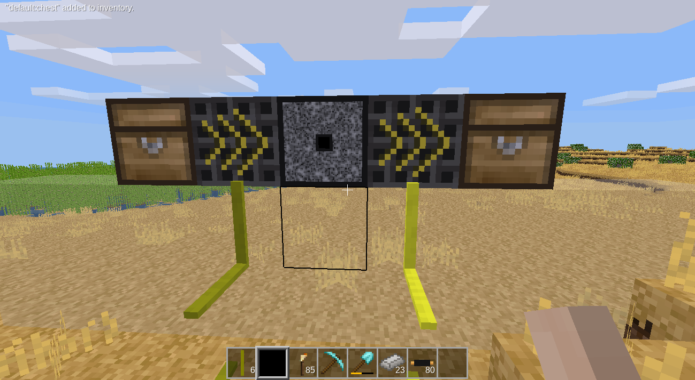

# Material science mod

This mod adds new materials and blocks into Minetest. It's in pre-alpha stage currently.

For now, there's a screenshot of a decomposer block, which decomposes stone dust to the minerals.
The idea is to give user different types of materials (often in raw, oxidized state, requiring further processing).

